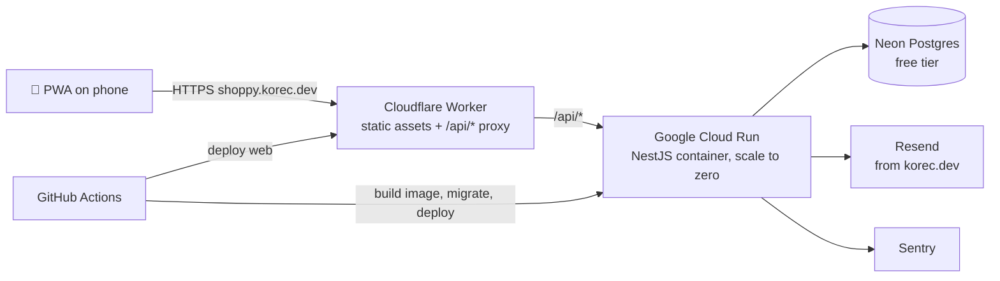
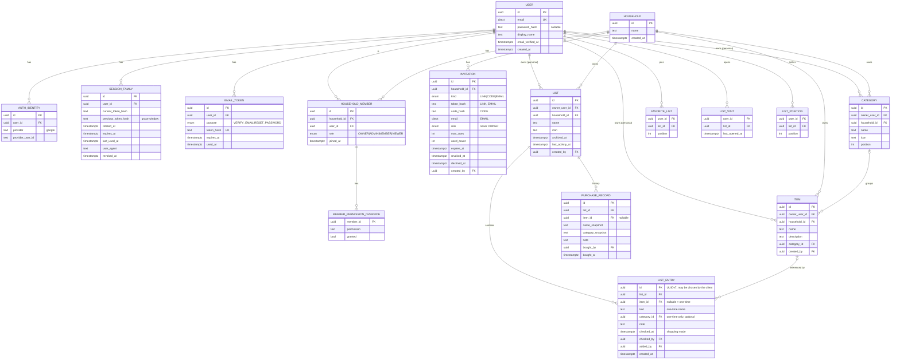

# 3. Architecture

## 3.1 Tech stack

| Layer              | Choice                                                                                                       | Why                                                                                            |
| ------------------ | ------------------------------------------------------------------------------------------------------------ | ---------------------------------------------------------------------------------------------- |
| Language           | TypeScript everywhere                                                                                        | Shared types and validation between frontend and backend                                       |
| Monorepo           | pnpm workspaces + Turborepo                                                                                  | One repo, cached builds, shared packages                                                       |
| Frontend           | React 19 + Vite                                                                                              | Chosen. Large ecosystem                                                                        |
| Routing            | TanStack Router                                                                                              | Type-safe routes and search params                                                             |
| Server state       | TanStack Query                                                                                               | Caching, optimistic updates; a good base for offline mode later                                |
| UI                 | Tailwind CSS + shadcn/ui (Radix)                                                                             | Accessible primitives, mobile-friendly, no runtime cost                                        |
| Icons              | Lucide (`lucide-react`)                                                                                      | Chosen icon library. A curated subset is offered for lists and categories                      |
| PWA                | `vite-plugin-pwa` (Workbox)                                                                                  | Manifest, service worker, update prompt                                                        |
| Backend            | NestJS 12 (ESM) on the Fastify adapter                                                                       | Chosen. Fastify has lower overhead and faster cold starts than Express                         |
| Validation         | Zod schemas in `packages/shared` + a small `ZodValidationPipe` in the API                                    | One schema drives API validation and frontend forms (`nestjs-zod` doesn't support Nest 12 yet) |
| ORM                | Prisma                                                                                                       | Good migrations, type-safe queries, works with Neon                                            |
| Database           | PostgreSQL (Neon)                                                                                            | Relational data with integrity constraints; generous free tier                                 |
| Auth               | Own implementation in NestJS                                                                                 | Chosen. See §3.4                                                                               |
| API docs           | OpenAPI generated from the Zod schemas (Swagger UI in dev)                                                   |                                                                                                |
| Testing            | Vitest everywhere (unit + API e2e via Fastify `inject`), Postgres service in CI; Playwright E2E from Phase 1 |                                                                                                |
| Linting/formatting | oxlint (type-aware) + Prettier, Husky + lint-staged                                                          | oxlint is what the Nest 12 template ships; one fast linter for the whole repo                  |
| Errors             | Sentry (free Developer plan)                                                                                 |                                                                                                |

## 3.2 Repository layout

```
shoppy/                         # repo (local folder: to-buy)
├── apps/
│   ├── api/
│   │   ├── src/bootstrap/      # app factory, Fastify hooks (proxy secret)
│   │   ├── src/config/         # validated env
│   │   ├── src/common/         # cross-feature pipes, guards, decorators
│   │   ├── src/infrastructure/ # prisma, logging, email adapters
│   │   ├── src/features/<f>/   # <f>.module, <f>.service, endpoints/<verb>-<thing>.endpoint.ts
│   │   └── test/<f>/           # endpoint e2e specs (createTestApp)
│   └── web/
│       ├── src/routes/         # thin TanStack file routes
│       ├── src/features/<f>/   # pages, components, use-* hooks
│       ├── src/components/     # ui/ (generic) and layout/ (app shell)
│       └── worker/             # Cloudflare Worker proxy
├── packages/
│   ├── shared/                 # Zod schemas, DTO types, permission enum + role matrix
│   └── config/                 # shared tsconfig bases
├── docs/                       # this documentation
├── .claude/                    # Claude Code rules, skills, agents, settings
├── .github/workflows/          # CI/CD
├── pnpm-workspace.yaml
└── turbo.json
```

Conventions (details in `.claude/rules/`): one unit per file (component, hook, class), **one API endpoint per file** with a single `handle` method delegating to an injected feature service, and comments only for a non-obvious "why".

The **permission catalog and role matrix live in `packages/shared`**, so the API (enforcement) and the web app (show/hide actions) always agree.

## 3.3 Hosting & deployment (all free tier)



| Component            | Service                                          | Free-tier notes (verify at setup time)                                                                                                                                        |
| -------------------- | ------------------------------------------------ | ----------------------------------------------------------------------------------------------------------------------------------------------------------------------------- |
| Frontend + API proxy | **Cloudflare Workers** (static assets + Worker)  | Static assets are free and unlimited; only `/api/*` runs the Worker (100k requests/day). Workers replace Pages, which Cloudflare no longer recommends for new projects (D-29) |
| Backend              | NestJS 12 (ESM) on the Fastify adapter           | Chosen. Fastify has lower overhead and faster cold starts than Express                                                                                                        |
| Database             | **Neon Postgres**                                | ~0.5 GB storage, scales to zero, branching for previews. Region `eu-central-1` (Frankfurt)                                                                                    |
| Container registry   | Google Artifact Registry                         | 0.5 GB free; keep only the last few images                                                                                                                                    |
| Email                | **Resend**                                       | 3,000 emails/month, 100/day. Sender `Shoppy <noreply@shoppy.korec.dev>`; SPF/DKIM/DMARC records in Cloudflare DNS                                                             |
| Domain & DNS         | **Cloudflare** (registrar + DNS for `korec.dev`) | `shoppy.korec.dev` is a Worker custom domain. `.dev` is HSTS-preloaded, so HTTPS is mandatory (Cloudflare handles it)                                                         |
| Error tracking       | Sentry                                           | Developer plan                                                                                                                                                                |
| CI/CD                | GitHub Actions                                   | Free for public repos; 2,000 min/month for private                                                                                                                            |

**Why the Cloudflare proxy?** The PWA and the API share **one origin** (`/api/*` is forwarded to Cloud Run). That gives us:

- first-party `SameSite=Strict` refresh cookies, which iOS Safari/ITP does not block (a cross-site cookie to `*.run.app` would be blocked);
- no CORS configuration;
- a single domain for the service worker.

**Region:** Cloud Run `europe-west3` (Frankfurt), next to Neon's Frankfurt region.

**Alternatives considered:**

- **Vercel (Hobby)**: one platform for the web app and the NestJS API, no card needed, and preview deploys include the API. Rejected because its functions have **no WebSockets**, and long-lived streams are cut at the function's max duration. That would complicate Phase 6 (real-time) and would mean either migrating the API later or adding a third-party real-time service. Cloud Run also runs a plain, portable Docker image, and Cloud Scheduler allows any cron schedule. (D-23)
- **Render free**: sleeps after 15 min idle and takes 30–60 s to wake, which is poor UX for "open the app in the shop".

## 3.4 Authentication design

**Goal:** no daily re-login on mobile, while keeping the session secure.

| Token         | Format                                               | Lifetime                                                                         | Storage                                                    |
| ------------- | ---------------------------------------------------- | -------------------------------------------------------------------------------- | ---------------------------------------------------------- |
| Access token  | JWT (HS256 or EdDSA), claims: `sub`, `sid`           | 15 min                                                                           | Memory only (JS variable)                                  |
| Refresh token | Opaque random 256-bit value, stored **hashed** in DB | 90 days **sliding**: every refresh issues a new token with a fresh 90-day expiry | `HttpOnly; Secure; SameSite=Strict; Path=/api/auth` cookie |

- **Refresh token format:** `<sessionId>.<secret>.<signature>`. Only a SHA-256 hash of the secret is stored. The session id lets an old, already rotated token still point at its family; the HMAC signature means a forged token can't trigger a reuse revocation. `/auth/refresh` and `/auth/logout` also reject requests whose `Sec-Fetch-Site` isn't `same-origin` (SameSite doesn't separate sibling subdomains).
- **Rotation + reuse detection:** every refresh rotates the token within a _token family_ (one family per device session). Presenting an already-used token revokes the whole family. A 30-second grace window accepts the previous token without rotating again, so two refreshes racing on app start don't look like theft. The web client also shares one in-flight refresh between callers.
- **Every request checks the session:** the guard verifies the JWT and then loads its session row, so revoking a device (or a password reset) takes effect immediately, not after 15 minutes.
- **App start:** the web app calls `POST /api/auth/refresh`. A valid cookie returns an access token and the user, and the user is signed in silently. A 401 on any other call triggers one refresh and a retry.
- **Sessions screen:** lists token families (device, last used) and allows revoking one or all of them.
- **Email/password:** Argon2id via `node:crypto` (19 MiB, 2 passes, OWASP minimum). Unknown emails are checked against a dummy hash, so timing doesn't reveal accounts. Rate limits per IP (IPv6 grouped by /64) and per account (in memory, D-37). Outgoing email is capped per day (D-46).
- **Email verification is required** (D-39): every route needs a verified user unless marked `@Public()` or `@AllowUnverified()` (`GET /me`, resend, logout). Verification and reset links are single-use, hashed in `email_tokens`, valid 24 h and 1 h.
- **Google:** Google Identity Services ("Sign in with Google" button) in the web app returns an **ID token**. The web app sends it to `POST /api/auth/google`, and the backend verifies it with `jose` against Google's JWKS (issuer, audience = our client ID, `email_verified`). This avoids full-page OAuth redirects, which are fragile in an installed iOS PWA. _(Spike task P0-07 validates this on iOS.)_
- **Account linking:** a Google identity is linked to an existing account with the same email. If that account was never verified, its password and sessions are removed (D-38). A user can have a password, Google, or both. Google-only users add a password through the reset link.
- **Installed PWA on iOS:** it has its own cookie storage, separate from Safari, so the user signs in once inside the installed app. Installed PWAs are exempt from Safari's 7-day storage eviction.

## 3.5 Authorization design

- A `ScopeAccess` service (`apps/api/src/common/scope/`) that every feature service calls with the permission of the action, e.g. `access.require(user, scopeOf(list), 'entry.check')`. A guard can't know the scope of a by-id route without loading the row, so the check happens in the service right after the row is loaded (D-59).
- The guard resolves the **scope** from the route (list → its scope, item → its scope, …):
  - personal scope → allowed only if `ownerUserId === currentUser`. Phase 2 implements this in the services: by-id lookups filter with `accessibleBy(user)`, so another user's row answers **404** (ids don't leak), and `/scopes/personal/...` routes take the scope from `@CurrentScope()` (`apps/api/src/common/scope/`);
  - household scope → load the membership and compute effective permissions (FR-R5); the result is cached per request.
- Rules for acting on another member (FR-R6) are checked in the members service, not only by permissions.
- The **permission matrix test** generates a test case for every (role × permission × override) combination.

## 3.6 Data model

"Scope" is modelled as two nullable foreign keys with a CHECK constraint: exactly one of `owner_user_id` and `household_id` is set.



Tables use plural snake_case names (`users`, `session_families`, `categories` …).

Key constraints:

- `CHECK ((owner_user_id IS NULL) <> (household_id IS NULL))` on CATEGORY, ITEM, LIST.
- ITEM.category_id must be in the same scope (enforced in the service layer, plus a composite FK where practical).
- LIST_ENTRY: `CHECK ((item_id IS NULL) <> (text IS NULL))` and `CHECK (item_id IS NULL OR category_id IS NULL)` (only one-time entries carry a category); the entry's item must be in the list's scope (FR-L4). Entries are listed in id order (UUIDv7, D-50), index `(list_id, id)`.
- LIST_ENTRY.checked_at / checked_by: struck through in shopping mode; Finish turns them into purchase records with `bought_at = checked_at` (D-47).
- Unique `(scope, lower(name))` on ITEM and CATEGORY.
- No uniqueness on `(list_id, item_id)`: the same item may appear several times (FR-L10).
- HOUSEHOLD_MEMBER unique `(household_id, user_id)`; exactly one OWNER per household (partial unique index). The Owner is only stored as that member's role (no `owner_id` on HOUSEHOLD).
- INVITATION: link tokens and codes are stored hashed (shown once when created); a CHECK ties the columns to the kind; the role is never OWNER.
- LIST.last_activity_at changes with any change to the list, its entries or its history (Lists screen "last activity" sort). LIST_POSITION holds a user's own order of the lists they can see; USER.lists_grouped / lists_sort hold their Lists screen view (D-56).
- Deleting a HOUSEHOLD deletes its lists first, then the rest cascades (an entry must keep an item or a text).
- PURCHASE_RECORD keeps `name_snapshot` so history survives item deletion. Index `(list_id, bought_at DESC)` serves both the adaptive recent window and pagination.
- **Check** = one transaction: insert PURCHASE_RECORD, delete LIST_ENTRY. **Restore** = the reverse. **Re-add** = insert LIST_ENTRY only.
- Deleting an ITEM first turns its entries into one-time entries (name and category copied, FR-I6); PURCHASE_RECORD.item_id is set to NULL.
- CATEGORY, ITEM and LIST have `owner_user_id` or `household_id` (scope CHECK); names are unique per user and per household.

## 3.7 API outline (REST, `/api`)

| Area        | Endpoints                                                                                                                                                                                                                                                                                          |
| ----------- | -------------------------------------------------------------------------------------------------------------------------------------------------------------------------------------------------------------------------------------------------------------------------------------------------- |
| Auth        | `POST /auth/register`, `/auth/login`, `/auth/google`, `/auth/refresh`, `/auth/logout`, `/auth/verify-email`, `/auth/resend-verification`, `/auth/forgot-password`, `/auth/reset-password`                                                                                                          |
| Me          | `GET/PATCH /me`, `POST /me/password`, `GET /me/sessions`, `DELETE /me/sessions/:id`, `DELETE /me/sessions` (all), `DELETE /me`, `GET /me/export`, `GET /me/dashboard`, `GET/POST/PATCH/DELETE /me/favorites`, `GET/PATCH /me/list-view` (grouping, sort), `PUT /me/list-view/order` (custom order) |
| Scopes      | Resources are addressed by scope: `/scopes/personal/...` and `/scopes/households/:hid/...`                                                                                                                                                                                                         |
| Categories  | `GET/POST {scope}/categories`, `PATCH/DELETE /categories/:id`, `POST {scope}/categories/reorder` (the complete new order)                                                                                                                                                                          |
| Items       | `GET/POST {scope}/items`, `PATCH/DELETE /items/:id`, `POST /items/copy` (target scope + item ids)                                                                                                                                                                                                  |
| Lists       | `GET /lists` (every list the user can see, with its scope), `GET/POST {scope}/lists`, `GET/PATCH/DELETE /lists/:id` (the detail includes the user's permissions on the list)                                                                                                                       |
| Entries     | `POST /lists/:id/entries`, `PATCH/DELETE /entries/:id`, `POST /entries/:id/check`, `POST /entries/:id/promote`, `POST /lists/:id/entries/bulk` (`{action: check\|delete, ids \| all}`), `POST /lists/:id/finish-shopping`; `PATCH /entries/:id` also takes `isChecked` (shopping mode)             |
| History     | `GET /lists/:id/history/recent` (adaptive window, FR-L12), `GET /lists/:id/history?cursor=&limit=` (paginated), `POST /history/:id/restore`, `POST /history/:id/readd`, `DELETE /history/:id`, `POST /lists/:id/history/bulk` (`{action: restore\|readd\|delete, ids}`)                            |
| Households  | `GET/POST /households`, `GET/PATCH/DELETE /households/:id`, `POST /households/:id/transfer`, `POST /households/:id/leave`                                                                                                                                                                          |
| Members     | `GET /households/:id/members`, `PATCH /members/:id` (role, overrides), `DELETE /members/:id`                                                                                                                                                                                                       |
| Invitations | `POST /households/:id/invitations`, `GET /households/:id/invitations`, `DELETE /invitations/:id`, `GET /invitations/pending`, `POST /invitations/preview` and `POST /invitations/accept` (token, code or pending invitation id, in the body), `POST /invitations/:id/decline`                      |

## 3.8 PWA specifics

- `display: standalone`, theme colours, maskable icons (192/512), iOS `apple-touch-icon` and splash meta tags.
- Service worker: precache the app shell. The API is network-only in the MVP (offline mode comes later).
- An "Update available" toast when a new service worker is waiting.
- An install hint: a custom prompt on Android (`beforeinstallprompt`) and an instructions sheet on iOS ("Share → Add to Home Screen").

## 3.9 Future-proofing for post-MVP features

- **Real-time:** Server-Sent Events from NestJS, or WebSockets (Cloud Run supports both). Scale-to-zero means connections drop when the instance is idle, and the client reconnects. With more than one instance, events need Postgres `LISTEN/NOTIFY` as a fan-out.
- **Offline:** TanStack Query persisted cache (IndexedDB) plus a mutation queue. Entry operations are designed to be idempotent from day one (client-generated UUIDs for new entries).
- **Push:** Web Push with VAPID keys (free) via `web-push`. iOS support needs an installed PWA on 16.4+.
- **Suggestions:** SQL over PURCHASE_RECORD (frequency and recency per item). No ML needed.
