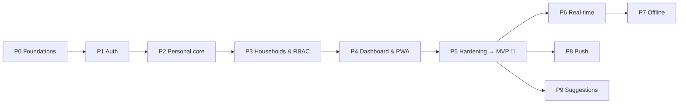

# 4. Roadmap — phases & tasks

Each phase ends with something deployable. Task IDs (`P1-03`) are meant to become GitHub issues.
The MVP is **Phases 0–5**. Phases 6–9 are post-MVP.

---

## Phase 0: Foundations & walking skeleton

**Goal:** an empty app running end to end in production: PWA → Cloudflare → Cloud Run → Neon, deployed by CI.

| ID    | Task                                                                                                                                                                                                                                                                                                            |
| ----- | --------------------------------------------------------------------------------------------------------------------------------------------------------------------------------------------------------------------------------------------------------------------------------------------------------------- |
| P0-01 | Accounts: GCP billing account + budget alert, Neon, Cloudflare, Resend (verify `shoppy.korec.dev` sending domain), Sentry, GitHub repo `shoppy` — ⏳ **You:** follow [06-infrastructure.md](06-infrastructure.md).                                                                                              |
| P0-02 | Init the Git repo and GitHub remote. pnpm workspaces + Turborepo; `apps/web`, `apps/api`, `packages/shared`, `packages/config` — ✅ Done (GitHub remote ⏳ you).                                                                                                                                                |
| P0-03 | Shared tooling: TypeScript strict, ESLint, Prettier, Husky + lint-staged, commit convention — ✅ Done, with oxlint instead of ESLint (D-31).                                                                                                                                                                    |
| P0-04 | `apps/api`: NestJS (Fastify), config module (env validation with Zod), health endpoint, Prisma + first migration, structured logging — ✅ Done. The first migration arrives with the Phase 1 models.                                                                                                            |
| P0-05 | `apps/web`: React + Vite + TanStack Router/Query + Tailwind + shadcn/ui; base mobile layout (bottom nav, safe areas) — ✅ Done. shadcn/ui components get added as Phase 1 needs them (tokens + `cn` are ready).                                                                                                 |
| P0-06 | PWA basics: `vite-plugin-pwa`, manifest, icons, update toast — ✅ Done (icons and iOS splash screens generated from `logo.svg`).                                                                                                                                                                                |
| P0-07 | **Spike:** Google Identity Services sign-in inside an _installed_ iOS PWA and an Android PWA. Confirm that the ID-token flow works and the first-party cookie persists — ⏳ Needs the deployed HTTPS URL + a Google OAuth client. Do it right after infra is up.                                                |
| P0-08 | Infrastructure: Neon project (plus a dev branch), GCP project + Cloud Run + Artifact Registry + budget alert, Cloudflare Worker (static assets + `/api/*` proxy) + custom domain `shoppy.korec.dev` — ⏳ **You:** [06-infrastructure.md](06-infrastructure.md). Cloudflare **Workers** instead of Pages (D-29). |
| P0-09 | CI: GitHub Actions for lint, type-check, test and build on PRs — ✅ Done (`.github/workflows/ci.yml`).                                                                                                                                                                                                          |
| P0-10 | CD: on `main`, build the API image → run `prisma migrate deploy` → deploy to Cloud Run; deploy the web app to Cloudflare Workers. GCP auth via Workload Identity Federation (no JSON keys) — ✅ Written (`.github/workflows/deploy.yml`); first real run after P0-08.                                           |
| P0-11 | Sentry wiring (web + api) — ✅ Done (enabled when a DSN is set).                                                                                                                                                                                                                                                |
| P0-12 | Local dev: `docker compose` Postgres, seed script, `.env.example`, README "getting started" — ✅ Done (no seed data until Phase 1).                                                                                                                                                                             |

**Done when:** https://shoppy.korec.dev serves an installable PWA showing `API: ok` from the health endpoint, and every merge to `main` deploys automatically.

---

## Phase 1: Authentication & account

**Goal:** users can register or sign in and stay signed in for months.

| ID    | Task                                                                                                                 |
| ----- | -------------------------------------------------------------------------------------------------------------------- |
| P1-01 | DB: `user`, `auth_identity`, `session_family`, email token tables                                                    |
| P1-02 | Register + login with email/password (Argon2id, Zod validation, rate limiting)                                       |
| P1-03 | Access JWT + rotating refresh cookie with reuse detection; `/auth/refresh`, `/auth/logout`                           |
| P1-04 | Google sign-in (`/auth/google`, ID-token verification, account linking)                                              |
| P1-05 | Email sending abstraction + Resend integration; SPF/DKIM/DMARC DNS records in Cloudflare; basic HTML email templates |
| P1-06 | Email verification + password reset flows                                                                            |
| P1-07 | Web: auth screens (sign in, register, forgot/reset), silent refresh on app start, 401 → refresh → retry interceptor  |
| P1-08 | Profile screen: display name, change password, active sessions (revoke one or all), logout                           |
| P1-09 | Seed the predefined personal categories on registration (shared seed definition in `packages/shared`)                |
| P1-10 | Tests: auth integration tests (rotation, reuse detection, expiry), E2E sign-in                                       |

**Done when:** a user can register (or use Google), close the app for days, reopen it and still be signed in. Revoking a session logs that device out.

---

## Phase 2: Personal core (categories, items, lists, entries, history)

**Goal:** the app is fully usable for one person.

| ID     | Task                                                                                                                                                 |
| ------ | ---------------------------------------------------------------------------------------------------------------------------------------------------- |
| P2-01  | Scope abstraction in the API (personal / household resolver) + personal-scope guard                                                                  |
| P2-02  | Curated Lucide icon set + icon picker component                                                                                                      |
| P2-03  | Categories CRUD + reorder (API + UI)                                                                                                                 |
| P2-04  | Items (catalog) CRUD, search, filter by category (API + UI)                                                                                          |
| P2-05  | Lists CRUD + archive (API + UI)                                                                                                                      |
| P2-06  | List detail: entries grouped by category, quick-add box with catalog autocomplete, one-time entries                                                  |
| P2-07  | Entry note editing; delete entry (permanent); duplicates allowed (FR-L10)                                                                            |
| P2-08  | Check entry → purchase record; collapsed **Recent history** section with the adaptive 7d/30d window (FR-L12)                                         |
| P2-09  | Promote a one-time entry to a catalog item                                                                                                           |
| P2-10  | History screen (paginated); **restore** (moves back) and **re-add** (copy) from history; delete history records                                      |
| P2-10b | Bulk actions: multi-select mode on entries (check/delete), Check all / Delete all with confirmation, multi-select in history (restore/re-add/delete) |
| P2-11  | Optimistic updates for add/check/restore/delete (snappy UX in the shop)                                                                              |
| P2-12  | Item deletion → entries become one-time entries (FR-I6)                                                                                              |
| P2-13  | Tests: API integration for all of the above; E2E "create list → add → check → restore" and bulk check                                                |

**Done when:** a single user can manage categories, their catalog and lists end to end on a phone.

---

## Phase 3: Households & RBAC

**Goal:** shared lists with enforced, configurable permissions.

| ID    | Task                                                                                                                                         |
| ----- | -------------------------------------------------------------------------------------------------------------------------------------------- |
| P3-01 | Permission catalog + role defaults and ceilings in `packages/shared`                                                                         |
| P3-02 | DB: `household`, `household_member`, `member_permission_override`; one-owner constraint                                                      |
| P3-03 | `PermissionsGuard` + `@RequirePermission` decorator; effective-permission resolver                                                           |
| P3-04 | Create a household (seeds categories), rename, delete (with confirmation)                                                                    |
| P3-05 | Household scope for categories, items, lists, entries and history (reusing the Phase 2 code through the scope abstraction)                   |
| P3-06 | Invitations: link, code, in-app (existing user by email), email. 7-day default expiry, max uses, revoke                                      |
| P3-07 | Accept/decline invitation flows (deep link `/join/:token`, "enter code" screen, pending list)                                                |
| P3-08 | Members screen: list members, change role, edit permission overrides (checkbox UI limited to the ceiling), remove member                     |
| P3-09 | Leave household; transfer ownership                                                                                                          |
| P3-10 | Copy items between personal ↔ household catalogs (FR-I5)                                                                                     |
| P3-11 | Web: permission-aware UI (hide or disable actions), a household switcher/section in navigation                                               |
| P3-12 | Account deletion rules for household owners (FR-A8)                                                                                          |
| P3-13 | Tests: generated permission-matrix tests, member-management rules (Admin can't touch the Owner or other Admins, etc.), invitation edge cases |

**Done when:** two users can share a household list, and every action in the RBAC matrix is enforced on the API and reflected in the UI.

---

## Phase 4: Dashboard & PWA polish

**Goal:** the app feels native on a phone.

| ID    | Task                                                                                                               |
| ----- | ------------------------------------------------------------------------------------------------------------------ |
| P4-01 | Favorites: star/unstar, reorder (drag and drop)                                                                    |
| P4-02 | Recently used lists (track list visits)                                                                            |
| P4-03 | Dashboard screen: favorites, recent, pending invitations                                                           |
| P4-04 | "All lists" screen grouped by Personal and each household                                                          |
| P4-05 | Install prompt (Android) + "Add to Home Screen" guide (iOS)                                                        |
| P4-06 | Native feel: pull to refresh, swipe to check/delete an entry, haptic-like feedback, skeleton loaders, empty states |
| P4-07 | Refetch on focus/visibility (a lightweight "sync" until Phase 6)                                                   |
| P4-08 | Lighthouse PWA/performance/accessibility pass on mobile                                                            |

**Done when:** the dashboard is the home screen and Lighthouse mobile scores are ≥ 90 for performance, accessibility and best practices.

---

## Phase 5: Hardening & MVP release 🚀

| ID    | Task                                                                                                   |
| ----- | ------------------------------------------------------------------------------------------------------ |
| P5-01 | Security review: rate limits, headers (CSP, HSTS), cookie flags, input limits, OWASP ASVS L1 checklist |
| P5-02 | GDPR: data export (JSON) + account deletion; privacy page                                              |
| P5-03 | Backups: verify Neon restore; document the restore runbook                                             |
| P5-04 | Free-tier guardrails: budget alerts, Neon storage monitoring, Artifact Registry cleanup policy         |
| P5-05 | Error and edge-case review in Sentry, fix the top issues                                               |
| P5-06 | Docs: user-facing help (install, invitations), operations runbook                                      |
| P5-07 | Release v1.0 (tag, changelog)                                                                          |

**Done when:** v1.0 is in real household use at $0/month.

---

## Post-MVP

### Phase 6: Real-time sync

| ID    | Task                                                                                           |
| ----- | ---------------------------------------------------------------------------------------------- |
| P6-01 | Event model for list/entry/item changes (scope-aware)                                          |
| P6-02 | SSE (or WebSocket) endpoint with auth; Postgres `LISTEN/NOTIFY` fan-out for multiple instances |
| P6-03 | Client: apply events to the TanStack Query cache; reconnect/backoff                            |
| P6-04 | Presence-light: show "Anna checked Milk" toasts                                                |

### Phase 7: Offline mode

| ID    | Task                                                                                       |
| ----- | ------------------------------------------------------------------------------------------ |
| P7-01 | Persist the query cache in IndexedDB; the service worker serves the shell offline          |
| P7-02 | Offline mutation queue with idempotent, client-generated IDs                               |
| P7-03 | Conflict rules (e.g. check wins over edit, last write wins on notes) + UI for failed syncs |
| P7-04 | Offline/online indicator                                                                   |

### Phase 8: Push notifications

| ID    | Task                                                                                              |
| ----- | ------------------------------------------------------------------------------------------------- |
| P8-01 | VAPID keys, push subscription storage per device                                                  |
| P8-02 | Notification triggers (entries added to a household list, invitation received), batched/debounced |
| P8-03 | Per-user notification settings; iOS install requirement messaging                                 |

### Phase 9: Buy-again suggestions

| ID    | Task                                                                       |
| ----- | -------------------------------------------------------------------------- |
| P9-01 | Suggestion query (frequency + time since last purchase per item and scope) |
| P9-02 | "Suggested" chips in the quick-add box and on an empty list                |
