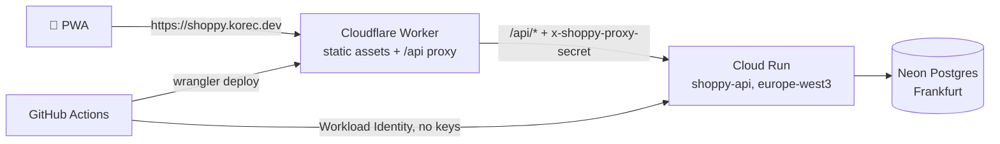

# 6. Production setup (one-time)

A copy-paste checklist that takes Shoppy live on **https://shoppy.korec.dev**. Every service is on a free tier. Expect about 30–45 minutes. After this, every push to `main` deploys automatically ([`.github/workflows/deploy.yml`](../.github/workflows/deploy.yml)).



| Service                              | Account                                  |
| ------------------------------------ | ---------------------------------------- |
| Google Cloud (project `shoppy-list`) | the Google account logged in to `gcloud` |
| Cloudflare (`korec.dev` zone)        | the account logged in to `wrangler`      |
| GitHub (`tom-korec/shoppy`)          | `gh`                                     |
| Neon                                 | any; sign in with GitHub or Google       |

> **Secrets never appear on screen.** They are generated and piped (`openssl … | …`) or copied and piped from the clipboard (`pbpaste | …`). Don't paste them into chats or files.

All commands run from the repo root in one terminal session; later steps reuse the shell variables from step 0.

---

## 0. Prerequisites

```bash
gcloud auth list          # the account you want to own the project must be ACTIVE (*)
gh auth status            # logged in as tom-korec
pnpm --filter @shoppy/web exec wrangler whoami   # Cloudflare account that owns korec.dev

PROJECT_ID=shoppy-list
REGION=europe-west3
GITHUB_REPO=tom-korec/shoppy
```

## 1. Neon database (browser, ~5 min)

1. Go to <https://console.neon.tech> → **New project**: name `shoppy`, Postgres **18**, region **AWS Europe Central 1 (Frankfurt)**.
2. Open **Connect**. You need two connection strings; both must end with `?sslmode=require`:
   - **Pooled** (_Connection pooling_ ON, host contains `-pooler`): the API uses this at runtime.
   - **Direct** (pooling OFF): migrations use this.

Keep the tab open; step 5 copies them one at a time.

## 2. Google Cloud project

```bash
gcloud projects create "$PROJECT_ID" --name="Shoppy"
```

If the ID is taken, choose another (e.g. `shoppy-list-$RANDOM`), update `PROJECT_ID`, and use that value everywhere below.

```bash
gcloud config set project "$PROJECT_ID"
PROJECT_NUMBER=$(gcloud projects describe "$PROJECT_ID" --format='value(projectNumber)')

BILLING_ACCOUNT=$(gcloud billing accounts list --filter=open=true --format='value(name)' --limit=1)
gcloud billing projects link "$PROJECT_ID" --billing-account="$BILLING_ACCOUNT"

gcloud services enable run.googleapis.com artifactregistry.googleapis.com \
  secretmanager.googleapis.com iamcredentials.googleapis.com billingbudgets.googleapis.com
```

**Budget alert.** You get emails at 50 % and 100 % of $1, so a surprise bill can't go unnoticed:

```bash
gcloud billing budgets create --billing-account="$BILLING_ACCOUNT" \
  --display-name="shoppy" --budget-amount=1USD \
  --threshold-rule=percent=0.5 --threshold-rule=percent=1.0
```

If this command complains about a quota project, create the budget in the console instead: _Billing → Budgets & alerts → Create budget_, $1, scoped to project `shoppy-list`.

## 3. Container registry

The registry keeps only the newest image (~110 MB of the 0.5 GB free storage). Rolling back means redeploying an older commit. The Deploy workflow applies migrations before pushing, so a failed migration never evicts the image the live service runs on.

```bash
gcloud artifacts repositories create shoppy --repository-format=docker --location="$REGION"

cat > /tmp/shoppy-cleanup.json <<'JSON'
[
  { "name": "keep-recent", "action": { "type": "Keep" }, "mostRecentVersions": { "keepCount": 1 } },
  { "name": "delete-rest", "action": { "type": "Delete" }, "condition": { "tagState": "ANY" } }
]
JSON
gcloud artifacts repositories set-cleanup-policies shoppy --location="$REGION" \
  --policy=/tmp/shoppy-cleanup.json --no-dry-run
```

## 4. Service accounts and permissions

`shoppy-api-runtime` runs the API; `shoppy-deployer` is what GitHub Actions acts as.

```bash
gcloud iam service-accounts create shoppy-api-runtime --display-name="Shoppy API runtime"
gcloud iam service-accounts create shoppy-deployer --display-name="Shoppy GitHub deployer"
RUNTIME_SA=shoppy-api-runtime@$PROJECT_ID.iam.gserviceaccount.com
DEPLOYER_SA=shoppy-deployer@$PROJECT_ID.iam.gserviceaccount.com

gcloud projects add-iam-policy-binding "$PROJECT_ID" \
  --member="serviceAccount:$DEPLOYER_SA" --role=roles/run.admin --condition=None
gcloud projects add-iam-policy-binding "$PROJECT_ID" \
  --member="serviceAccount:$DEPLOYER_SA" --role=roles/artifactregistry.writer --condition=None
gcloud iam service-accounts add-iam-policy-binding "$RUNTIME_SA" \
  --member="serviceAccount:$DEPLOYER_SA" --role=roles/iam.serviceAccountUser
```

**Workload Identity Federation:** GitHub Actions authenticates without keys, and only from `tom-korec/shoppy`.

```bash
gcloud iam workload-identity-pools create github --location=global --display-name="GitHub"
gcloud iam workload-identity-pools providers create-oidc github \
  --location=global --workload-identity-pool=github \
  --issuer-uri="https://token.actions.githubusercontent.com" \
  --attribute-mapping="google.subject=assertion.sub,attribute.repository=assertion.repository" \
  --attribute-condition="assertion.repository=='$GITHUB_REPO'"

gcloud iam service-accounts add-iam-policy-binding "$DEPLOYER_SA" \
  --role=roles/iam.workloadIdentityUser \
  --member="principalSet://iam.googleapis.com/projects/$PROJECT_NUMBER/locations/global/workloadIdentityPools/github/attribute.repository/$GITHUB_REPO"
```

## 5. Secrets

**Proxy secret.** It's generated once and stored in both GCP (for the API) and GitHub (for the Worker), without ever being printed:

```bash
PROXY_SECRET=$(openssl rand -hex 32)
printf '%s' "$PROXY_SECRET" | gcloud secrets create shoppy-proxy-secret --data-file=-
printf '%s' "$PROXY_SECRET" | gh secret set PROXY_SECRET --repo "$GITHUB_REPO"
unset PROXY_SECRET
```

**Neon connection strings.** Copy one string in the Neon tab, run its command, then do the same for the other:

```bash
# 1) copy the POOLED string, then:
pbpaste | tr -d '\n' | gcloud secrets create shoppy-database-url --data-file=-

# 2) copy the DIRECT string, then:
pbpaste | tr -d '\n' | gh secret set DATABASE_URL_DIRECT --repo "$GITHUB_REPO"
```

**Let the API read its secrets:**

```bash
for s in shoppy-database-url shoppy-proxy-secret; do
  gcloud secrets add-iam-policy-binding "$s" \
    --member="serviceAccount:$RUNTIME_SA" --role=roles/secretmanager.secretAccessor
done
```

## 6. Cloudflare API token (browser)

1. <https://dash.cloudflare.com/profile/api-tokens> → **Create Token** → **Create Custom Token**, name `shoppy-github-deploy`:

   | Type    | Resource        | Permission |
   | ------- | --------------- | ---------- |
   | Account | Workers Scripts | Edit       |
   | Zone    | Workers Routes  | Edit       |
   | Zone    | DNS             | Edit       |
   | Zone    | Zone            | Read       |

   Account resources: _your account_. Zone resources: _Specific zone → `korec.dev`_.

2. Create the token, copy it, and store it right away:

```bash
pbpaste | tr -d '\n' | gh secret set CLOUDFLARE_API_TOKEN --repo "$GITHUB_REPO"
```

3. Store the **Account ID** shown by `wrangler whoami` (step 0):

```bash
gh variable set CLOUDFLARE_ACCOUNT_ID --repo "$GITHUB_REPO" --body "<account-id>"
```

## 7. GitHub variables

All variables and secrets are **repository-level**. The workflow reads `GCP_PROJECT_ID` before a job's environment is applied, so environment-scoped variables would not be visible.

```bash
gh variable set GCP_PROJECT_ID --repo "$GITHUB_REPO" --body "$PROJECT_ID"
gh variable set GCP_DEPLOY_SERVICE_ACCOUNT --repo "$GITHUB_REPO" --body "$DEPLOYER_SA"
gh variable set GCP_WIF_PROVIDER --repo "$GITHUB_REPO" \
  --body "projects/$PROJECT_NUMBER/locations/global/workloadIdentityPools/github/providers/github"
gh variable set API_ORIGIN --repo "$GITHUB_REPO" --body "https://shoppy-api-$PROJECT_NUMBER.$REGION.run.app"

gh variable list --repo "$GITHUB_REPO"
gh secret list --repo "$GITHUB_REPO"   # expect PROXY_SECRET, DATABASE_URL_DIRECT, CLOUDFLARE_API_TOKEN
```

Cloud Run URLs are deterministic (`https://<service>-<project-number>.<region>.run.app`), so `API_ORIGIN` is known before the first deploy.

## 8. Go live

```bash
gh variable set DEPLOY_ENABLED --repo "$GITHUB_REPO" --body true
gh workflow run deploy.yml --repo "$GITHUB_REPO"
sleep 5 && gh run watch "$(gh run list --repo "$GITHUB_REPO" --workflow deploy.yml --limit 1 --json databaseId --jq '.[0].databaseId')" --repo "$GITHUB_REPO"
```

The run builds and pushes the API image, applies migrations to Neon, deploys Cloud Run, then deploys the Worker and creates the `shoppy.korec.dev` custom domain (DNS record and certificate). The certificate can take a few minutes the first time.

## 9. Verify

```bash
curl -s https://shoppy.korec.dev/api/health
# {"status":"ok","version":"<short sha>","checks":{"database":"up"},...}

curl -s -o /dev/null -w '%{http_code}\n' "https://shoppy-api-$PROJECT_NUMBER.$REGION.run.app/api/health"
# 403 (direct access is blocked by the proxy secret)
```

On your phone, open https://shoppy.korec.dev:

- **Android (Chrome):** menu → _Install app_.
- **iOS (Safari):** Share → _Add to Home Screen_.

The Profile tab should show **API: Online**.

---

## Troubleshooting

| Symptom                                                                              | Likely cause → fix                                                                                                                                                                               |
| ------------------------------------------------------------------------------------ | ------------------------------------------------------------------------------------------------------------------------------------------------------------------------------------------------ |
| `google-github-actions/auth` fails with "unauthorized_client" or "permission denied" | Repo name in the WIF condition doesn't match exactly (`tom-korec/shoppy`), or the `workloadIdentityUser` binding is missing → rerun step 4                                                       |
| Docker push denied                                                                   | Deployer lacks `roles/artifactregistry.writer`, or the repository isn't in `europe-west3`                                                                                                        |
| `gcloud run deploy` fails on `--set-secrets`                                         | A secret is missing, or the runtime SA lacks `secretAccessor` → rerun the secret bindings in step 5                                                                                              |
| `gcloud run deploy` fails with "Permission 'iam.serviceaccounts.actAs' denied"       | Missing `serviceAccountUser` binding on the runtime SA (step 4)                                                                                                                                  |
| Migrations fail with a connection error                                              | `DATABASE_URL_DIRECT` is the pooled string or lacks `?sslmode=require`                                                                                                                           |
| Wrangler fails with an authentication error or "not authorized for this zone"        | Token permissions or zone scope (step 6). Create a new token and `gh secret set` it again                                                                                                        |
| `shoppy.korec.dev` shows a certificate error                                         | First-time certificate issuance; wait a few minutes                                                                                                                                              |
| Health returns `503 API_ORIGIN is not configured`                                    | `API_ORIGIN` variable empty or wrong → fix and rerun the Deploy workflow                                                                                                                         |
| Health returns `403` through the domain                                              | `PROXY_SECRET` differs between GitHub and GCP → regenerate it with the step 5 block (use `gcloud secrets versions add shoppy-proxy-secret --data-file=-` for the existing secret), then redeploy |
| Health shows `"database":"down"`                                                     | `shoppy-database-url` is wrong (should be the pooled string)                                                                                                                                     |

## Later: Sentry and Resend

- **Sentry** (optional): create projects `shoppy-api` (NestJS) and `shoppy-web` (React), then `gh variable set SENTRY_DSN_API …` / `SENTRY_DSN_WEB …` and redeploy.
- **Resend** (Phase 1, email): add the domain `shoppy.korec.dev` at <https://resend.com/domains>, add its DNS records in Cloudflare, and store the API key as GCP secret `shoppy-resend-api-key`.

## Free-tier guardrails

| Service            | Limit to watch                        | Guardrail                                                       |
| ------------------ | ------------------------------------- | --------------------------------------------------------------- |
| Cloud Run          | 2M requests, 180k vCPU-s/month        | `max-instances=2`, scale to zero, $1 budget alert               |
| Artifact Registry  | 0.5 GB storage                        | Cleanup policy keeps only the newest image (~110 MB compressed) |
| Neon               | 0.5 GB storage, monthly compute hours | Scales to zero. Nothing pings the DB health check on a schedule |
| Cloudflare Workers | 100k Worker requests/day              | Only `/api/*` invokes the Worker; static assets are free        |
| Secret Manager     | 6 active secret versions              | Disable old versions after rotating                             |
