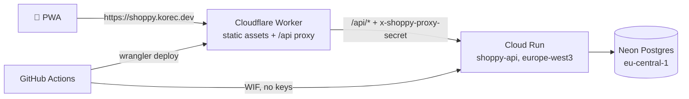

# 6. Infrastructure setup (one-time)

These steps create the production environment. All services are on free tiers. Run them once, in order; afterwards every push to `main` deploys automatically ([`.github/workflows/deploy.yml`](../.github/workflows/deploy.yml)).



> **Why a Worker and not Pages?** Cloudflare now recommends Workers with static assets for new projects. The setup is the same idea as the Pages + Functions plan in the architecture doc: static files are served for free, and only `/api/*` invokes the Worker (`run_worker_first`). Config lives in [`apps/web/wrangler.jsonc`](../apps/web/wrangler.jsonc).

Placeholders used below:

| Placeholder   | Example                                  |
| ------------- | ---------------------------------------- |
| `PROJECT_ID`  | `shoppy-korec` (must be globally unique) |
| `GITHUB_REPO` | `<your-github-user>/shoppy`              |

---

## 1. Neon (database)

1. Create a project **shoppy** at <https://console.neon.tech>: Postgres **17**, region **AWS Europe Central 1 (Frankfurt)**.
2. Copy two connection strings from _Connect_:
   - **Pooled** (host contains `-pooler`): used by the API at runtime → `NEON_POOLED_URL`.
   - **Direct** (no `-pooler`): used for migrations → `NEON_DIRECT_URL`.

   Both must end with `?sslmode=require`.

## 2. Google Cloud (API hosting)

```bash
PROJECT_ID=shoppy-korec
REGION=europe-west3
GITHUB_REPO=<your-github-user>/shoppy

gcloud projects create "$PROJECT_ID" --name="Shoppy"
gcloud billing accounts list                       # pick the billing account id
gcloud billing projects link "$PROJECT_ID" --billing-account=<BILLING_ACCOUNT_ID>
gcloud config set project "$PROJECT_ID"
PROJECT_NUMBER=$(gcloud projects describe "$PROJECT_ID" --format='value(projectNumber)')

gcloud services enable run.googleapis.com artifactregistry.googleapis.com \
  secretmanager.googleapis.com iamcredentials.googleapis.com billingbudgets.googleapis.com
```

**Budget alert**, so nobody is surprised by a bill:

```bash
gcloud billing budgets create --billing-account=<BILLING_ACCOUNT_ID> \
  --display-name="shoppy" --budget-amount=1USD \
  --threshold-rule=percent=0.5 --threshold-rule=percent=1.0
```

**Container registry.** It keeps only the 3 newest images, to stay inside the 0.5 GB free storage:

```bash
gcloud artifacts repositories create shoppy --repository-format=docker --location="$REGION"
cat > /tmp/shoppy-cleanup.json <<'JSON'
[
  { "name": "keep-recent", "action": { "type": "Keep" }, "mostRecentVersions": { "keepCount": 3 } },
  { "name": "delete-rest", "action": { "type": "Delete" }, "condition": { "tagState": "ANY" } }
]
JSON
gcloud artifacts repositories set-cleanup-policies shoppy --location="$REGION" \
  --policy=/tmp/shoppy-cleanup.json --no-dry-run
```

**Runtime secrets:**

```bash
PROXY_SECRET=$(openssl rand -hex 32)   # keep it for the GitHub step below
printf '%s' "<NEON_POOLED_URL>" | gcloud secrets create shoppy-database-url --data-file=-
printf '%s' "$PROXY_SECRET"     | gcloud secrets create shoppy-proxy-secret --data-file=-
```

**Service accounts:** one for the running API, one for GitHub deploys.

```bash
gcloud iam service-accounts create shoppy-api-runtime --display-name="Shoppy API runtime"
gcloud iam service-accounts create shoppy-deployer --display-name="Shoppy GitHub deployer"
RUNTIME_SA=shoppy-api-runtime@$PROJECT_ID.iam.gserviceaccount.com
DEPLOYER_SA=shoppy-deployer@$PROJECT_ID.iam.gserviceaccount.com

for s in shoppy-database-url shoppy-proxy-secret; do
  gcloud secrets add-iam-policy-binding "$s" \
    --member="serviceAccount:$RUNTIME_SA" --role=roles/secretmanager.secretAccessor
done

gcloud projects add-iam-policy-binding "$PROJECT_ID" --member="serviceAccount:$DEPLOYER_SA" --role=roles/run.admin
gcloud projects add-iam-policy-binding "$PROJECT_ID" --member="serviceAccount:$DEPLOYER_SA" --role=roles/artifactregistry.writer
gcloud iam service-accounts add-iam-policy-binding "$RUNTIME_SA" \
  --member="serviceAccount:$DEPLOYER_SA" --role=roles/iam.serviceAccountUser
```

**Workload Identity Federation.** GitHub Actions authenticates without JSON keys, and only from this repository:

```bash
gcloud iam workload-identity-pools create github --location=global --display-name="GitHub"
gcloud iam workload-identity-pools providers create-oidc github \
  --location=global --workload-identity-pool=github \
  --issuer-uri="https://token.actions.githubusercontent.com" \
  --attribute-mapping="google.subject=assertion.sub,attribute.repository=assertion.repository" \
  --attribute-condition="assertion.repository=='$GITHUB_REPO'"

gcloud iam service-accounts add-iam-policy-binding "$DEPLOYER_SA" \
  --role=roles/iam.workloadIdentityUser \
  --member="principalSet://iam.googleapis.com/projects/$PROJECT_NUMBER/locations/global/workloadIdentityPools/github/attribute.repository/$GITHUB_REPO"

echo "GCP_WIF_PROVIDER=projects/$PROJECT_NUMBER/locations/global/workloadIdentityPools/github/providers/github"
echo "API_ORIGIN=https://shoppy-api-$PROJECT_NUMBER.$REGION.run.app"
```

Cloud Run's URL is deterministic (`https://<service>-<project-number>.<region>.run.app`), so `API_ORIGIN` is known before the first deploy.

## 3. Cloudflare (web + proxy)

1. **Account ID:** shown on the right side of the dashboard's _Workers & Pages_ overview.
2. **API token:** _My Profile → API Tokens → Create Token → "Edit Cloudflare Workers"_ template. Scope it to your account and the zone `korec.dev`.
3. Nothing to create by hand: the first `wrangler deploy` creates the Worker `shoppy-web` and the custom domain `shoppy.korec.dev`, including DNS and the certificate.

## 4. GitHub

1. Create the repository `shoppy` (private is fine) and push this repo.
2. _Settings → Environments → New environment_ `production`. Add the following:

| Kind     | Name                         | Value                                                  |
| -------- | ---------------------------- | ------------------------------------------------------ |
| Variable | `GCP_PROJECT_ID`             | `PROJECT_ID`                                           |
| Variable | `GCP_WIF_PROVIDER`           | printed by step 2                                      |
| Variable | `GCP_DEPLOY_SERVICE_ACCOUNT` | `shoppy-deployer@PROJECT_ID.iam.gserviceaccount.com`   |
| Variable | `API_ORIGIN`                 | printed by step 2                                      |
| Variable | `CLOUDFLARE_ACCOUNT_ID`      | step 3                                                 |
| Variable | `SENTRY_DSN_API`             | optional (step 5)                                      |
| Variable | `SENTRY_DSN_WEB`             | optional (step 5)                                      |
| Secret   | `DATABASE_URL_DIRECT`        | `NEON_DIRECT_URL`                                      |
| Secret   | `PROXY_SECRET`               | the same value as the `shoppy-proxy-secret` GCP secret |
| Secret   | `CLOUDFLARE_API_TOKEN`       | step 3                                                 |

3. Push to `main` (or run _Actions → Deploy → Run workflow_). Then check:

```bash
curl https://shoppy.korec.dev/api/health          # {"status":"ok",...}
curl -i "$API_ORIGIN/api/health"                  # 403: direct access is blocked by the proxy secret
```

## 5. Sentry (optional)

Create two projects at <https://sentry.io> (Developer plan): **shoppy-api** (Node / NestJS) and **shoppy-web** (React). Put their DSNs into `SENTRY_DSN_API` and `SENTRY_DSN_WEB`. Both apps run without them.

## 6. Resend (needed in Phase 1)

Add the domain `shoppy.korec.dev` at <https://resend.com/domains> and add the shown DNS records (SPF, DKIM, DMARC) in Cloudflare DNS. The API key goes into a GCP secret `shoppy-resend-api-key` once Phase 1 wires up email.

---

## Free-tier guardrails

| Service            | Limit to watch                        | Guardrail                                                       |
| ------------------ | ------------------------------------- | --------------------------------------------------------------- |
| Cloud Run          | 2M requests, 180k vCPU-s/month        | `max-instances=2`, scale to zero, $1 budget alert               |
| Artifact Registry  | 0.5 GB storage                        | Cleanup policy keeps 3 images (~110 MB each, compressed)        |
| Neon               | 0.5 GB storage, monthly compute hours | Scales to zero. Nothing pings the DB health check on a schedule |
| Cloudflare Workers | 100k Worker requests/day              | Only `/api/*` invokes the Worker; static assets are free        |
| Secret Manager     | 6 active secret versions              | Don't keep old versions enabled                                 |
